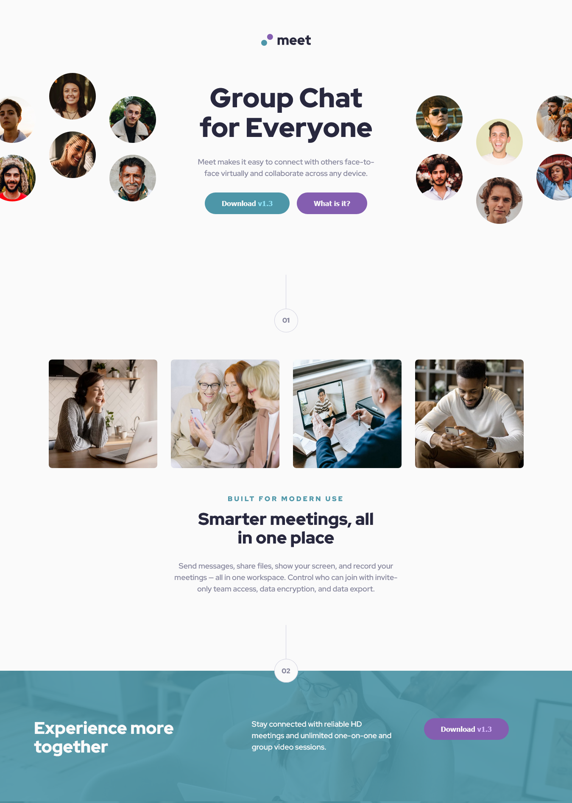

# Frontend Mentor - Meet landing page solution

This is a solution to the [Meet landing page challenge on Frontend Mentor](https://www.frontendmentor.io/challenges/meet-landing-page-rbTDS6OUR). Frontend Mentor challenges help you improve your coding skills by building realistic projects.

## Table of contents

- [Overview](#overview)
    - [Screenshot](#screenshot)
    - [Links](#links)
- [Built with](#built-with)
- [Author](#author)

## Overview

### Screenshot

### Links

- [Solution URL here](https://github.com/ajibade-ibrahim/meet-landing-page)
- [Live site URL here](https://ajibade-ibrahim.github.io/meet-landing-page/)

### Built with

- HTML5 markup
- CSS
- Grid

## Author

- [LinkedIn](https://www.linkedin.com/in/ibrahim-kayode-ajibade/)
- [Frontend Mentor Profile](https://www.frontendmentor.io/profile/ajibade-ibrahim)
